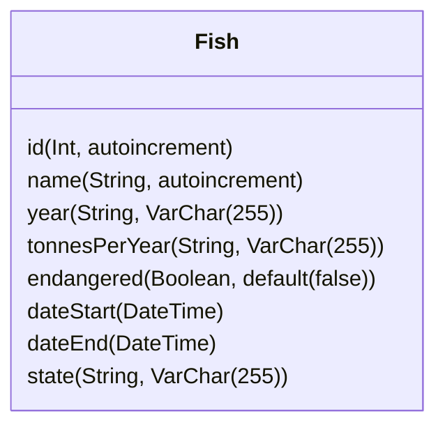

# SafeFishing-API
 API para el Proyecto [SafeFishing](https://github.com/Ange1D/SafeFishing). del Hackathon Hack The Ocean | LaunchX 
 
 
 
| Endpoint | Request | Response |
|---|---|---|
| `localhost:3000/fish` | `localhost:3000/fish` | Obtiene todos los registros de la tabla Fish |
| `localhost:3000/fish/:estado` | `localhost:3000/fish/Veracruz` | Obtiene todos los registros de la tabla Fish que sean de Veracruz |

 
 Diagrama de la Tabla Fish
 

 
 ## Autores:

- [Ange1D](https://github.com/Ange1D).

- [EAleman8](https://github.com/EAleman8).

- [porfirioclv](https://github.com/porfirioclv).

- [ahranza](https://github.com/ahranza).
